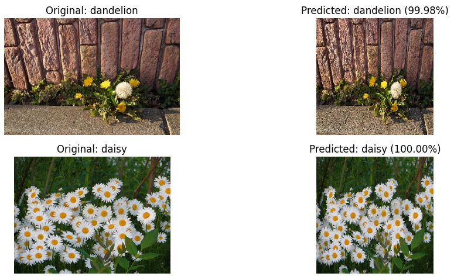

# Flower Classifier

Um projeto de **Visão Computacional** aplicado à classificação automática de flores.  
A proposta foi treinar um modelo capaz de identificar corretamente **cinco espécies diferentes** de flores a partir de imagens, utilizando técnicas modernas de **Deep Learning**.

---

## Contexto

A identificação de espécies vegetais é uma tarefa importante em áreas como agricultura, biologia e preservação ambiental.  
O objetivo aqui foi aplicar **redes neurais convolucionais** e **transfer learning** para demonstrar como a Inteligência Artificial pode auxiliar nesse processo.

---

## Como foi feito

- Exploração inicial do dataset, com análise de imagens e balanceamento das classes.  
- Criação de pipeline de dados com **normalização** e **aumento artificial das imagens (data augmentation)**.  
- Construção do modelo com **EfficientNetB0 pré-treinado** no ImageNet.  
- Ajuste fino (fine-tuning) das últimas camadas para adaptar o modelo ao dataset.  
- Treinamento monitorado com EarlyStopping para evitar overfitting.  

---

## Resultados

O modelo atingiu **acurácia superior a 97% no conjunto de validação**, mostrando boa capacidade de generalização.  
Além disso, foram gerados gráficos de evolução do treinamento e matrizes de confusão para avaliar a performance.  

Exemplo de saída do modelo:  

